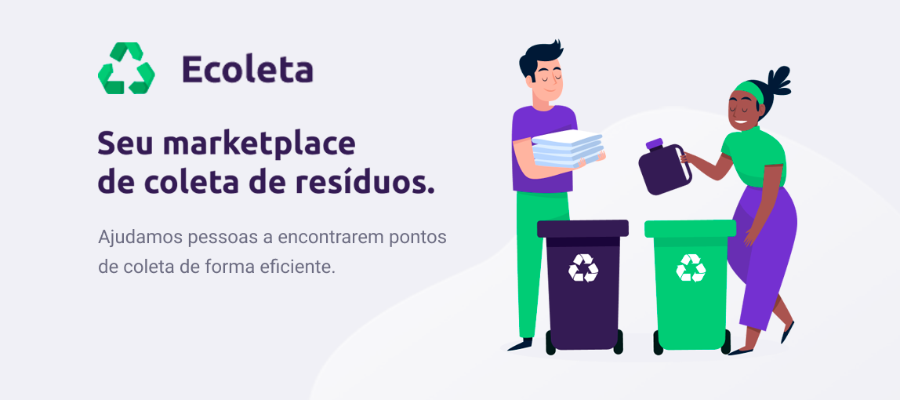

## Sobre o Projeto
Este projeto visa conectar entidades responsáveis pelo gerenciamento de coleta seletiva cadastrando 
os postos de coleta. Na aplicação mobile, os usuários poderão buscar pelos pontos mais próximos de seus estados e cidades para efeturem os descartes, obtendo o detalhamento do pontos de coleta, como nome da entidade, endereço e tipo de material que é coletado, podendo também contar com filtro por tipo de material a ser descartado quando específico, no caso de eletrônicos ou orgânicos. Somado a facilidade em encontrar o ponto de coleta, há a opção do usuário entrar em contato direto com a entidade.